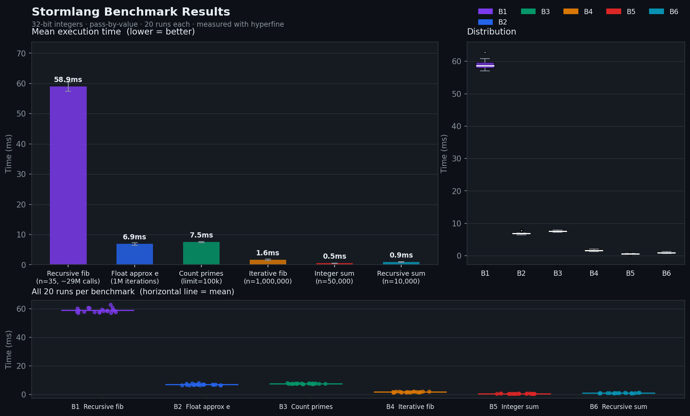

```       __                        
  _______/  |_  ___________  _____  
 /  ___/\   __\/  _ \_  __ \/     \ 
 \___ \  |  | (  <_> )  | \/  Y Y  \
/____  > |__|  \____/|__|  |__|_|  /
     \/                          \/ 
```

This project is discontinued, it was extremely valuable for my understanding of compilers and the Assembly language but hence "learning project", I later noticed alot of architectural and language faults due to learning on the go.

I plan to develop another language with a considerably more refined scope and better though out language features!

Storm is a procedural C styled language. It is being developed solely for learning purposes but feel free to make a pull request if your interested in helping out!

[These are the upcoming features](storm/TODO.md)

### Contents
* [Features](#features)
* [Language Design](#language-design)
* [Implementation Architecture](#implementation-architecture)
* [Example](#example)
* [Details](#details)
* [Benchmarks](#benchmarks)

### Features

* Procedures aka functions
* Procedure calls and recursion
* Quadruple three address code Intermediate Representation
* Tail Call Optimization
* Loop unrolling
* Custom struct definitions
* Various integrated types: int, double, string, bool, char, void (built in data structures soon)
* Multiple files and folder support
* Narrowing and widening conversion
### Language Design

Storm is designed to feel familiar to anyone who has written C or C++ but with a few simplifications and modern touches. It uses static typing with explicit type declarations for variables and procedure parameters.

The grammar is procedural. There are no classes or object oriented features. Instead data is organized into custom structs called storms which can be accessed via dot notation.

Control flow includes standard if statements, while loops, and for loops. There is also a dedicated range loop for iterating through number sequences easily. Built in functions like echo are provided to make printing to the standard output simpler without needing format specifiers.

Memory management is entirely static right now. Variables and struct fields are allocated on the stack.

### Implementation Architecture

The compiler is written in C++ and uses exclusively smart pointers for memory safety during parsing and analysis. The compilation pipeline is broken down into distinct passes.

1. Lexical Analysis
The lexer reads raw text files and groups characters into recognized tokens. It tracks file names, line numbers, and columns for error reporting.

2. Parsing
A recursive descent parser takes the tokens and constructs an Abstract Syntax Tree. The tree represents the hierarchical structure of the program including procedures, loops, block scopes, and mathematical expressions.

3. Semantic Analysis
The AST then undergoes semantic analysis. A symbol table is generated to track variable scope, verify return types, and catch undeclared or duplicate identifiers. This phase also implicitly converts types when needed, like wrapping integers in double conversion nodes, and calculates stack memory offsets.

4. Intermediate Representation
Instead of generating assembly directly from the syntax tree, the compiler walks the AST to emit a linear Intermediate Representation. It uses a custom quadruple three address code. This abstracts away the target architecture and made it much easier to implement optimisations such as tail call optimization and segmented loop unrolling.

5. Code Generation
The backend takes the linear IR instructions and translates them directly into NASM compatible x86 64 assembly instructions. It handles basic CPU register usage and sets up local stack frames for every procedure call.

### Example
```storm
proc int fib(num: int) {
    if(num < 2) {
        return num;
    }

    return fib(n - 1) + fib(n - 2);
}

proc void main(void) {

    range(i = 0..50) {
        echo(i);
    }

    fib_result: int = fib(45);
    echo(fib_result);
}
```

# Register allocation stategy (Linear scan)
- Will include benchmarks soon!
- https://www.usenix.org/legacy/events/vee05/full_papers/p132-wimmer.pdf

The algorithm implement

1. LINEAR SCAN ALGORITHM consists of two register pools ( double) and other a register pool for every other datatype
2. Calls free_registers to see if there is an outdated variable that has been assigned to a register, incoming intrvl takes that register
3. if no register is available, we resort to stealing from a variable with the longest lifetime
4. get_reg() is called in backend.h get_addr() when finding a register for a variable 


### Details
* Compiler currently produces assembly, im using NASM and gcc to build the elf64 file.


### Benchmarks

